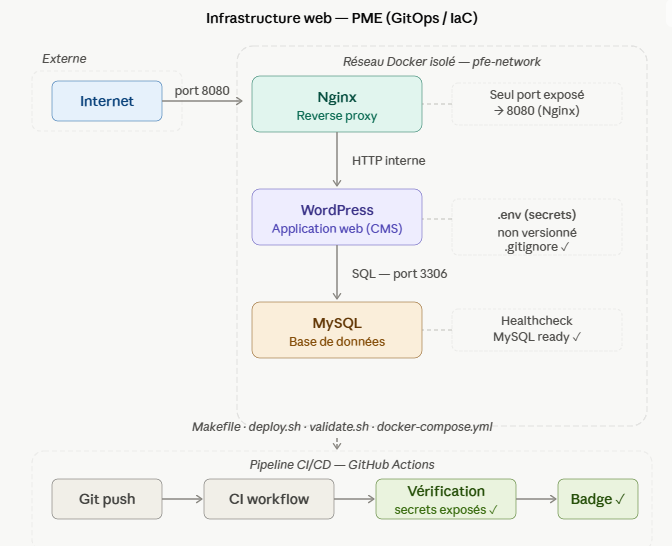

# PFE Infrastructure — Déploiement automatisé avec Docker Compose

[](https://github.com/massila77/pfe-infrastructure/actions/workflows/ci.yml/badge.svg)

## Présentation du projet

Ce projet met en place une infrastructure web automatisée et reproductible pour une PME.
Il s'inscrit dans une démarche GitOps / Infrastructure as Code (IaC).

L'infrastructure déploie automatiquement trois services :

- **Nginx** : reverse proxy qui reçoit les requêtes des utilisateurs
- **WordPress** : application web (CMS)
- **MySQL** : base de données

## Architecture



L'infrastructure est organisée en 3 couches : Nginx en reverse proxy reçoit les requêtes sur le port 8080, les transmet à WordPress qui interroge MySQL en interne. Les 3 services communiquent sur un réseau Docker isolé (pfe-network), seul le port 8080 est exposé vers l'extérieur.

## Prérequis

- Git
- Docker Desktop
- Docker Compose v2
- GNU Make (optionnel, voir note ci-dessous)

> **Note Windows / Git Bash** : `make` n'est pas installé par défaut sur Windows.
> Toutes les commandes du Makefile peuvent être exécutées directement avec
> Docker Compose, sans `make`. Voir la table d'équivalence dans la section
> "Commandes disponibles" ci-dessous.

## Procédure de déploiement

### 1. Cloner le dépôt

```bash
git clone https://github.com/massila77/pfe-infrastructure.git
cd pfe-infrastructure
```

### 2. Configurer les secrets

```bash
cp .env.example .env
```

Editer le fichier `.env` et remplir les valeurs :
```
MYSQL_ROOT_PASSWORD=VotreMotDePasse
MYSQL_DATABASE=appdb
MYSQL_USER=appuser
MYSQL_PASSWORD=VotreMotDePasse
WORDPRESS_DB_PASSWORD=VotreMotDePasse
```

### 3. Lancer le déploiement

Avec le Makefile (si `make` est installé) :

```bash
make deploy
```

Ou manuellement (fonctionne sur tous les OS, y compris Windows sans `make`) :

```bash
cd docker
docker compose --env-file ../.env up -d
```

### 4. Accéder au site

Le site est accessible sur : **http://localhost:8080**

## Commandes disponibles

| Commande (avec make) | Équivalent sans make (Docker Compose direct) | Description |
|---|---|---|
| `make deploy` | `cd docker && docker compose --env-file ../.env up -d` | Lancer l'infrastructure |
| `make stop` | `cd docker && docker compose --env-file ../.env stop` | Arrêter l'infrastructure |
| `make restart` | `cd docker && docker compose --env-file ../.env restart` | Redémarrer l'infrastructure |
| `make validate` | `bash scripts/validate.sh` | Vérifier que tout fonctionne |
| `make logs` | `cd docker && docker compose --env-file ../.env logs -f` | Afficher les logs |
| `make clean` | `cd docker && docker compose --env-file ../.env down` | Supprimer tous les conteneurs |

## Procédure de validation

```bash
make validate
# ou sans make :
bash scripts/validate.sh
```

## Procédure de nettoyage

```bash
make clean
# ou sans make :
cd docker && docker compose --env-file ../.env down
```

## CI/CD

Ce projet utilise **GitHub Actions** pour vérifier automatiquement à chaque push :

- La syntaxe du fichier docker-compose.yml
- La présence de tous les fichiers obligatoires
- Qu'aucun secret n'est exposé dans le dépôt

## Sécurité

- Les secrets sont stockés dans un fichier `.env` non versionné
- Le fichier `.env` est listé dans `.gitignore`
- Un fichier `.env.example` documente les variables sans exposer les valeurs
- Les services communiquent sur un réseau Docker isolé `pfe-network`
- Seul le port 8080 est exposé vers l'extérieur
- Principe du moindre privilège : un utilisateur MySQL dédié pour WordPress
- Healthcheck automatique sur MySQL

## Structure du projet

```
pfe-infrastructure/
├── .github/
│   └── workflows/
│       └── ci.yml              ← pipeline CI/CD
├── docker/
│   └── docker-compose.yml      ← configuration des services
├── config/
│   └── nginx.conf              ← configuration Nginx
├── scripts/
│   ├── deploy.sh                ← script de déploiement
│   ├── validate.sh              ← script de validation
│   ├── logs.sh                  ← script d'affichage des logs
│   └── backup.sh                ← script de sauvegarde
├── docs/
│   ├── architecture.png         ← schéma d'architecture
│   └── note-securite.md         ← note de sécurité
├── Makefile                     ← raccourcis de commandes
├── .env.example                 ← modèle des secrets
├── .gitignore                   ← fichiers exclus de Git
└── README.md                    ← documentation
```

## Auteur

Massila — ECE Paris — B3 AIS — 2026
